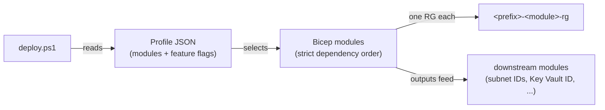

# Azure Demo Environment (ADE)

[](https://www.powershellgallery.com/packages/AzureDemoEnvironment)
[](https://www.powershellgallery.com/packages/AzureDemoEnvironment)
[](LICENSE)
[](https://www.cisecurity.org/benchmark/azure)
[](https://learn.microsoft.com/en-us/powershell/)
[](https://github.com/vegazbabz/azure-demo-environment/actions/workflows/lint.yml)

> **[⬇️ Get it from the PowerShell Gallery](https://www.powershellgallery.com/packages/AzureDemoEnvironment)** — `Install-PSResource AzureDemoEnvironment`

A fully automated, modular Azure infrastructure project for **security benchmark testing** and **environment provisioning**. Deploy a complete multi-tier Azure environment in minutes — either with out-of-the-box Azure defaults (to measure your baseline CIS/MCSB score) or with CIS/MCSB-hardened configuration (to measure remediations).

> [!WARNING]
> **Deploying resources from this repository will incur real costs in your Azure subscription.**
> Every module provisions billable Azure resources. Some — such as Azure Firewall, DDoS Protection, and VPN Gateway — are expensive even when idle. See [Cost guidance](#cost-guidance) for estimates.
> **The author of this repository accepts no responsibility for any Azure costs, charges, or overspend incurred by anyone using this project.** You are solely responsible for monitoring and managing spend in your own subscription. Before deploying, set up [Azure Cost Management budgets and alerts](https://learn.microsoft.com/azure/cost-management-billing/costs/tutorial-acm-create-budgets) to cap unexpected spend.

**New to Azure?** Start with [Prerequisites](#prerequisites) and [Your first deployment](#your-first-deployment).  
**Just want to see what this deploys?** Skip to [What gets deployed](#what-gets-deployed).  
**Setting up CI/CD?** Jump to [GitHub Actions setup](#github-actions-setup).  

---

## Table of contents

- [What gets deployed](#what-gets-deployed)
- [How it works](#how-it-works)
- [Prerequisites](#prerequisites)
- [Your first deployment](#your-first-deployment)
- [Deployment profiles](#deployment-profiles)
- [Feature flags](#feature-flags)
- [Deployment modes](#deployment-modes)
- [All deploy.ps1 parameters](#all-deployps1-parameters)
- [Tearing down](#tearing-down)
- [Custom profiles](#custom-profiles)
- [Known limitations](#known-limitations)
- [Scripts reference](#scripts-reference)
- [Cost guidance](#cost-guidance)
- [Seed data](#seed-data)
- [Auto start/stop](#auto-startstop)
- [Cost dashboard](#cost-dashboard)
- [Running tests](#running-tests)
- [GitHub Actions setup](#github-actions-setup)
- [Repository structure](#repository-structure)
- [CIS / MCSB benchmark guide](#cis--mcsb-benchmark-guide)
- [License](#license)
- [Contributing](#contributing)

---

## What gets deployed

12 independent Bicep modules are available. Each module deploys into its own dedicated resource group (e.g. `ade-compute-rg`). Modules are **independently toggleable** — you only pay for what you enable.

| Module | Default resources | Notable opt-in features |
| --- | --- | --- |
| `monitoring` | Log Analytics Workspace, Application Insights, Action Group | Alert rules |
| `networking` | VNet (10.0.0.0/16), all subnets, NSGs, Bastion (Developer SKU — free) | Application Gateway, Azure Firewall, VPN Gateway, NAT Gateway, DDoS Protection, Private DNS Zones |
| `security` | Key Vault (RBAC model), User-Assigned Managed Identity | Defender for Cloud (all plans), Microsoft Sentinel |
| `compute` | Windows Server 2022 VM (`Standard_B2s`) | Ubuntu 22.04 VM, VM Scale Set |
| `storage` | General-purpose v2 Storage Account | Data Lake Gen2, File Shares, soft delete, versioning |
| `databases` | Azure SQL Server + Serverless Database (AdventureWorksLT) | SQL Server on VM (IaaS), Cosmos DB (serverless), PostgreSQL Flexible Server, MySQL Flexible Server, Redis Cache |
| `appservices` | App Service Plan (B1), Windows Web App, Function App, Logic App | — |
| `containers` | Container Registry (Basic), AKS (1-node, free tier), Container Apps, Container Instances | — |
| `integration` | Service Bus (Standard), Event Hub (Basic), Event Grid, SignalR | API Management |
| `ai` | — (all resources opt-in due to cost and quota) | Azure AI Services, Azure OpenAI, Cognitive Search, Machine Learning |
| `data` | — (all resources opt-in due to cost and quota) | Data Factory, Synapse Analytics, Databricks, Microsoft Purview |
| `governance` | Automation Account (auto-stop/start), optional budget alerts | Resource locks, Azure Policy initiative assignments |

> `ai` and `data` are disabled in all built-in profiles by default due to cost and quota requirements. Enable them in a custom profile when needed.

---

## How it works



1. You run `deploy.ps1` with a **profile** (which modules to enable and which features to turn on) and a **mode** (`default` = baseline, `hardened` = CIS/MCSB-aligned).
2. The script deploys modules in strict dependency order: `monitoring → networking → security → compute → storage → databases → appservices → containers → integration → ai → data → governance`.
3. Each module's Bicep receives outputs from upstream modules (e.g. the subnet ID from networking, the Key Vault ID from security) as parameters.
4. After deployment, an optional seed-data step populates databases and storage with realistic sample data.

The orchestration is **pure PowerShell 7 + Azure CLI**. No Azure PowerShell module (`Az.*`) is required.

---

## Prerequisites

### Required software

| Tool | Minimum version | Install |
| --- | --- | --- |
| PowerShell | 7.0 (7.4+ recommended) | [github.com/PowerShell/PowerShell](https://github.com/PowerShell/PowerShell/releases) |
| Azure CLI | 2.60 | [learn.microsoft.com/cli/azure/install-azure-cli](https://learn.microsoft.com/cli/azure/install-azure-cli) |
| Bicep CLI | latest | `az bicep install` (run once after installing Azure CLI) |

**Windows note:** PowerShell 7 is separate from Windows PowerShell 5.1. Install it from the link above. Scripts will refuse to run on 5.1.

### Required Azure access

- An Azure **subscription** with at least **Contributor** role
- For governance features (policy assignments, resource locks): **User Access Administrator** role as well

### Check you are ready

```powershell
# Verify PowerShell version — must say 7.x or higher
$PSVersionTable.PSVersion

# Verify Azure CLI is installed
az version

# Log in to Azure
az login

# Set the subscription you want to deploy into
az account set --subscription "<your-subscription-id>"

# Confirm the right subscription is active
az account show --query "{name:name, id:id}" -o table
```

---

## Your first deployment

### Step 1 — Install the module (or clone the repository)

**Option A — PowerShell Gallery** (recommended). The module exports four
commands that wrap the repository scripts one-to-one: `Deploy-AdeEnvironment`
(deploy.ps1), `Remove-AdeEnvironment` (destroy.ps1), `Initialize-AdeSeedData`
(seed-data.ps1), and `Get-AdeCostDashboard`. All parameters are identical to
the scripts.

```powershell
Install-PSResource AzureDemoEnvironment
# or, on older PowerShellGet: Install-Module AzureDemoEnvironment -Scope CurrentUser
```

> The examples in the rest of this README use the `./scripts/...` form. If you
> installed the module, substitute the matching command anywhere — the
> parameters are identical: `./scripts/deploy.ps1 ...` → `Deploy-AdeEnvironment ...`

**Option B — clone the repository** and run the scripts directly (required if
you want to edit profiles or Bicep templates in place):

```bash
git clone https://github.com/vegazbabz/azure-demo-environment.git
cd azure-demo-environment
```

### Step 2 — Deploy the minimal profile

The `minimal` profile is the lowest-cost starting point. It deploys: monitoring, networking, security (Key Vault + managed identity), one Windows VM, storage, and governance automation. Estimated cost: **~$15–30/month** with auto-shutdown enabled. Budget alerts are deployed only when an alert email is provided.

```powershell
# Module install (Option A)
Deploy-AdeEnvironment -Profile minimal -Location westeurope -Prefix ade

# Repo clone (Option B) — PowerShell 7, run from the repo root
./scripts/deploy.ps1 -Profile minimal -Location westeurope -Prefix ade
```

Admin passwords are handled automatically: a separate cryptographically random password is generated **per service** (VM, SQL, PostgreSQL, MySQL, Synapse) and stored in the environment's Key Vault — nothing is printed to the terminal. Pass `-AdminPassword` to use one value for all services instead (min 12 characters with uppercase, lowercase, a digit, and a symbol); it is also synced to Key Vault. Profiles without a Key Vault fall back to a single generated password shown in a console banner.

The script will:

1. Ask for a budget alert email when budgets are enabled and no email is configured (interactive runs only).
2. Print a summary of what will be deployed, including whether budget alerts are enabled or skipped.
3. Ask for confirmation (press **Y** to proceed, **N** to abort).
4. Deploy each module in order, printing live progress.
5. Print a summary of all deployed resources when finished.

### Step 3 — Tear it down when done

```powershell
# Module install (Option A)
Remove-AdeEnvironment -Prefix ade -Force

# Repo clone (Option B)
./scripts/destroy.ps1 -Prefix ade -Force
```

This deletes ADE-managed resource groups for the prefix and discovered Azure-managed resource groups that belong to the environment.

---

## Deployment profiles

Profiles live in `config/profiles/` (bundled inside the module when installed from the Gallery). Pass the profile name (no path, no `.json`) or the path to a custom JSON file.

### Built-in profiles

| Profile | Modules enabled | Estimated cost | Best for |
| --- | --- | --- | --- |
| `minimal` | monitoring, networking, security, compute (Windows VM), storage, governance | ~$15–30/month | First run, orientation, low-cost baseline |
| `compute-only` | monitoring, networking, security, compute (Windows + Linux + VMSS), governance | ~$60–100/month | CIS Compute sections, VM hardening testing |
| `networking-only` | monitoring, networking (+ App Gateway), governance | ~$200–300/month | Network topology and connectivity testing |
| `databases-only` | monitoring, networking, security, databases (SQL + Cosmos DB), governance | ~$80–150/month | Database benchmark testing |
| `security-focus` | monitoring, networking, security (+ Defender + Sentinel), compute (Windows + Linux), storage, databases (SQL only), governance (+ locks) | ~$100–200/month | Security posture and Defender coverage testing |
| `full` | 10 standard modules (`ai` and `data` disabled) | ~$300–500/month | Complete standard CIS/MCSB coverage without quota-heavy AI/data services |
| `hardened` | 10 standard modules with hardening flags enabled (`ai` and `data` disabled) | ~$300–500/month | CIS v5.0.0/MCSB-aligned hardened environment |

```powershell
./scripts/deploy.ps1 -Profile minimal      -Location westeurope -Prefix ade
./scripts/deploy.ps1 -Profile compute-only -Location westeurope -Prefix ade
./scripts/deploy.ps1 -Profile full         -Location westeurope -Prefix ade
```

---

## Feature flags

Every module exposes feature flags in its profile `features` block (e.g. `databases.features.postgresql`). The full per-module flag tables — defaults, costs, and caveats — live in **[docs/reference.md](docs/reference.md#feature-flags)**.

---

## Deployment modes

| Mode | Bicep path | Purpose |
| --- | --- | --- |
| `default` (default) | `bicep/modules/` | Out-of-the-box Azure settings — no hardening, no enforced TLS, public network access at defaults. Use this to establish a pre-hardening **benchmark baseline**. |
| `hardened` | `bicep/hardened/` | Uses CIS v5.0.0/MCSB-aligned templates: TLS 1.2 minimum, public network access disabled where supported, purge protection on Key Vault, and hardened resource settings. Optional controls such as Defender, Sentinel, resource locks, and policy assignments still follow the selected profile's feature flags. Use `-Profile hardened -Mode hardened` for the full hardened profile. |

```powershell
# Baseline (default) — measure "before" score
./scripts/deploy.ps1 -Profile full -Mode default -Location westeurope -Prefix ade

# Hardened — measure "after" score
./scripts/deploy.ps1 -Profile hardened -Mode hardened -Location westeurope -Prefix ade
```

You can also deploy both side-by-side using different prefixes:

```powershell
./scripts/deploy.ps1 -Profile full     -Mode default  -Prefix adebase
./scripts/deploy.ps1 -Profile hardened -Mode hardened -Prefix adehard
```

---

## All deploy.ps1 parameters

The complete parameter tables for `deploy.ps1` and `destroy.ps1` live in **[docs/reference.md](docs/reference.md#all-deployps1-parameters)**.

---

## Tearing down

```powershell
# Destroy everything with the 'ade' prefix
./scripts/destroy.ps1 -Prefix ade

# Destroy only specific modules
./scripts/destroy.ps1 -Prefix ade -Modules compute,containers

# Destroy asynchronously (faster, no per-group confirmation)
./scripts/destroy.ps1 -Prefix ade -NoWait -Force
```

### destroy.ps1 parameters

| Parameter | Type | Default | Description |
| --- | --- | --- | --- |
| `-Prefix` | string | `ade` | ADE prefix used at deploy time. Matches resource groups named `<prefix>-*-rg` that carry the `managedBy=ade` tag, plus discovered Azure-managed resource groups that belong to those modules. |
| `-Modules` | string[] | all | Specific modules to destroy. Example: `-Modules compute,containers` |
| `-SubscriptionId` | string | current account | Target subscription |
| `-NoWait` | switch | — | Delete resource groups asynchronously (faster, no per-group error confirmation) |
| `-Force` | switch | — | Skip all confirmation prompts |
| `-LogFile` | string | — | Path for a plain-text log file |

The destroy script:

1. Removes any resource locks on matching resource groups first.
2. Discovers Azure-managed resource groups that do not follow the ADE prefix convention, including AKS node RGs, Synapse managed RGs, Databricks managed RGs, ML App Insights managed RGs, and Defender default workspace RGs.
3. Pre-deletes owning resources where direct RG deletion is unsafe, such as Synapse and Databricks workspaces.
4. Deletes each matching resource group.
5. By default waits for each deletion to complete before continuing (so errors are visible).

> **Tip:** If a resource group deletion fails due to a lock or a protected resource, re-run the script — it will retry cleanly.

---

## Custom profiles

Copy any built-in profile from `config/profiles/`, adjust modules and features, and pass its path: `./scripts/deploy.ps1 -Profile ./my-profile.json`. Schema, validation rules, and worked examples: **[docs/reference.md](docs/reference.md#custom-profiles)**.

---

## Known limitations

The following constraints are by design and cannot be changed via flags or parameters:

| Area | Limitation |
| --- | --- |
| **Network topology** | VNet address space is fixed at `10.0.0.0/16`. All subnets are pre-allocated and cannot be resized or renamed without editing the Bicep directly. |
| **Single region** | Each ADE deployment targets one Azure region. Multi-region is not supported. |
| **One instance per module** | Each module deploys exactly one resource group per prefix. You cannot, for example, deploy two separate SQL modules to the same prefix. Use different prefixes for parallel environments. |
| **Feature flags are JSON-only** | There is no CLI flag to override a single feature flag (e.g. `mysql: true`) without editing the profile JSON. `-EnableModules` / `-SkipModules` toggle whole modules on/off, not individual features. |
| **PostgreSQL / MySQL seeding** | `seed-data.ps1` skips these automatically if `psql` / `mysql` is not installed. See [Seed data](#seed-data) for options including Azure Cloud Shell. |
| **`data` module defaults** | All `data` module features (`dataFactory`, `synapse`, `databricks`, `purview`) default to `false` even when the module is enabled. You must explicitly set the features you want in your custom profile. Using `-EnableModules data` on the command line auto-enables **all** features including Synapse Analytics, Databricks, and Microsoft Purview — which carry significant cost. |
| **Synapse managed resource group** | When `data.synapse` is enabled, Azure Synapse creates a platform-managed resource group named `synapseworkspace-managedrg-<guid>` outside the ADE `{prefix}-*-rg` naming convention. Do not treat it as manually created. `destroy.ps1` discovers it from the Synapse workspace, pre-deletes the workspace when needed, and waits for Azure to remove the managed RG. |
| **Microsoft Purview — one free-tier account per tenant** | Azure allows only one free-tier Purview account per Entra ID tenant, and it cannot be re-created in a different region. If you already have a Purview account in your tenant at a different location, `deploy.ps1` will automatically skip Purview and log a warning. To deploy Purview, either use the same region as the existing account or set `purview: false` in your profile to opt out. |
| **Windows PowerShell 5.1** | All scripts require PowerShell 7.0+. They will not run on Windows PowerShell 5.1. |
| **Azure CLI only** | No Az PowerShell module is used or supported. All Azure calls go through the Azure CLI (`az`). |
| **Governance module and monitoring** | The `governance` module requires `monitoring` to also be enabled when deploying a full environment. Deploying `governance` alone (without monitoring) is supported but Automation Account runbooks will lack a Log Analytics workspace destination. |
| **`ai` and `data` not in any built-in profile** | Neither `ai` nor `data` modules are enabled in any built-in profile. Use a custom profile to enable them. |
| **Azure ML workspace soft-delete (14-day hold)** | When `destroy.ps1` removes the `ai` resource group, the ML workspace enters a **14-day soft-delete period** during which Azure blocks recreation with the error *"Soft-deleted workspace exists. Please purge or recover it."* `deploy.ps1` automatically catches this and retries the AI module without Machine Learning so all other AI resources (AI Services, OpenAI, Cognitive Search) still deploy. To force-purge the soft-deleted workspace immediately: open the [Azure Portal](https://portal.azure.com) → **Machine Learning** → **Recently deleted** → select the workspace → **Purge**. There is no CLI or REST API path to purge a workspace that entered soft-delete after its resource group was deleted — the ARM `deletedWorkspaces` endpoint does not exist in the ML provider manifest for standard subscriptions. |

---

## Scripts reference

All entry-point scripts and helpers are catalogued in **[docs/reference.md](docs/reference.md#scripts-reference)**.

---

## Cost guidance

> [!IMPORTANT]
> **Disclaimer:** Deploying resources from this repository will create billable Azure resources in your subscription. The author of this project accepts **no responsibility** for any charges, costs, or overspend incurred by anyone using this code. Always configure [Azure Cost Management budgets](https://learn.microsoft.com/azure/cost-management-billing/costs/tutorial-acm-create-budgets) with email alerts before deploying, and tear down environments when they are not in use.

Most modules are inexpensive at rest. The following resources carry meaningful ongoing cost:

| Resource | Approximate monthly cost |
| --- | --- |
| Azure Firewall Standard | ~$900 |
| Azure Firewall Premium | ~$1,500 |
| DDoS Network Protection | ~$2,944 — **enable only when you explicitly need it** |
| VPN Gateway (VpnGw1) | ~$140 |
| Application Gateway WAF v2 (idle) | ~$200–300 |
| Bastion Basic/Standard | ~$140–200 (Developer SKU is free) |
| AKS (1-node `Standard_B2s`) | ~$30–50 |
| SQL Managed Instance | ~$1,000+ |
| Defender for Servers (per VM) | ~$15/VM/month |
| Microsoft Sentinel (per GB) | ~$2.46/GB ingested |

The deployment script warns you before deploying any expensive resources and shows an estimated cost total. The `governance` module creates a budget alert that emails you when spend reaches 80% and 100% of the configured threshold only when a budget alert email is supplied. Interactive runs prompt for this email before the deployment summary. `-Force`, `-WhatIf`, CI, and GitHub Actions runs do not prompt; they skip budget deployment unless `-BudgetAlertEmail` or `governance.features.budgetAlertEmail` is set.

### Keeping costs low during testing

- Use the `minimal` profile to start.
- Enable `enableAutoShutdown: true` — VMs are deallocated every evening at 19:00 UTC automatically.
- Destroy the environment when not in use: `./scripts/destroy.ps1 -Prefix ade -Force`
- Use [the cost dashboard](#cost-dashboard) to spot unexpected spend.

---

## Seed data

After deployment, `./scripts/seed-data.ps1 -Prefix <prefix>` populates storage, databases, Key Vault, and messaging resources with realistic sample data. Database passwords are fetched from the environment Key Vault automatically. Details, per-target tables, and client prerequisites: **[docs/operations.md](docs/operations.md#seed-data)**.

---

## Auto start/stop

The governance module schedules a daily VM stop (and optional start) via Automation runbooks. Configuration: **[docs/operations.md](docs/operations.md#auto-startstop)**.

---

## Cost dashboard

`./scripts/dashboard/Get-AdeCostDashboard.ps1` summarizes running resources and month-to-date spend. Usage: **[docs/operations.md](docs/operations.md#cost-dashboard)**.

---

## Running tests

The test suite uses [Pester 5](https://pester.dev/) and runs entirely without Azure credentials — all Azure CLI calls are mocked.

```powershell
# Install Pester (one-time setup)
Install-Module Pester -RequiredVersion 5.7.1 -Force -Scope CurrentUser

# Run the full suite
./tests/Invoke-PesterSuite.ps1

# Run with CI-style output (used by GitHub Actions)
./tests/Invoke-PesterSuite.ps1 -CI
```

Current state: **678 passing, 0 failing, 0 skipped**.

Test coverage includes:

- Profile JSON schema validation
- `deploy.ps1` and `destroy.ps1` parameter validation
- Module deployment orchestration logic (module ordering, feature flag propagation)
- `validate.ps1` pre-flight checks
- JSON config correctness for all built-in profiles
- Gallery module: manifest metadata, wrapper↔script parameter parity, staged package layout

---

## GitHub Actions setup

Deploy and destroy workflows run via OIDC (no stored cloud credentials). Full setup — app registration, federated credential, secrets, and variables — is in **[docs/operations.md](docs/operations.md#github-actions-setup)**.

---

## Repository structure

The annotated directory tree lives in **[docs/reference.md](docs/reference.md#repository-structure)**.

---

## CIS / MCSB benchmark guide

### The before/after approach

ADE is designed for **paired benchmark comparisons**:

1. Deploy with `-Mode default` — Azure out-of-the-box settings, no hardening.
2. Run a compliance scan and record the score.
3. Deploy with `-Profile hardened -Mode hardened` to the same subscription (same prefix or a parallel prefix).
4. Re-run the scan and compare.

The control coverage below assumes the built-in `hardened` profile is deployed with `-Mode hardened`.

### CIS Azure Foundations Benchmark v5.0.0 — control coverage

| CIS Section | Topic | ADE module | Hardened control |
| --- | --- | --- | --- |
| 1.x | Identity and access management | `security`, `governance` | Key Vault RBAC, managed identity |
| 2.1 | Microsoft Defender for Cloud | `security` | All Defender plans enabled |
| 2.2 | Defender recommendations | `governance` | Policy assignments in Enforce mode |
| 3.x | Storage accounts | `storage` | HTTPS-only, public access disabled, infrastructure encryption |
| 4.x | Databases | `databases` | TLS 1.2, Azure AD auth, Transparent Data Encryption, Threat Detection |
| 5.x | Logging and monitoring | `monitoring`, `governance` | Diagnostic settings, Activity Log alerts, Sentinel |
| 6.x | Networking | `networking` | NSG rules, Bastion, no management ports exposed |
| 7.x | Virtual machines | `compute` | AMA extension, Defender for Endpoint, disk encryption, no public IPs |
| 8.x | App services | `appservices` | HTTPS-only, TLS 1.2, managed identity, FTP disabled |
| 9.x | Key Vault | `security` | Purge protection, soft delete, private endpoints |

> **Not in scope:** Section 1.x Entra ID tenant-level settings (MFA, SSPR, Conditional Access, guest access) require tenant-admin permissions and cannot be managed with subscription-scoped IaC.

### Running a compliance scan

#### Option 1 — Defender for Cloud (Azure portal)

1. Open **Microsoft Defender for Cloud → Regulatory compliance**
2. Select **CIS Azure Foundations Benchmark v5.0.0** or **Microsoft Cloud Security Benchmark**
3. Expand controls to see compliant vs. non-compliant resources

#### Option 2 — Azure Policy via CLI

```bash
# Overall compliance summary for the subscription
az policy state summarize \
  --subscription <subscription-id> \
  --query "results.policyDetails[].{policy:policyDefinitionId,compliant:results.compliantResources,noncompliant:results.nonCompliantResources}" \
  -o table

# Compliance for all ADE resource groups only (filter by prefix)
az policy state list \
  --subscription <subscription-id> \
  --filter "resourceGroup eq 'ade-compute-rg'" \
  --query "[?complianceState=='NonCompliant'].{resource:resourceId,policy:policyDefinitionId}" \
  -o table
```

#### Option 3 — CISAzureFoundationsBenchmark (PowerShell)

[CISAzureFoundationsBenchmark](https://www.powershellgallery.com/packages/CISAzureFoundationsBenchmark) is a companion PowerShell module that audits the subscription against the CIS Microsoft Azure Foundations Benchmark v6.0.0 and produces a self-contained HTML compliance report. It is read-only and works well for scoring an ADE deployment — run it once against a default-mode environment for the baseline and again after deploying with `-Mode hardened` to measure the remediations.

```powershell
Install-Module CISAzureFoundationsBenchmark -Scope CurrentUser
Connect-AzAccount
Invoke-CISAzureAudit -TenantId (Get-AzContext).Tenant.Id
```

---

## License

MIT — see [LICENSE](LICENSE).

---

## Contributing

Contributions are welcome. See [CONTRIBUTING.md](CONTRIBUTING.md) for guidelines on branching, commit style, and running the test suite locally before opening a PR.
